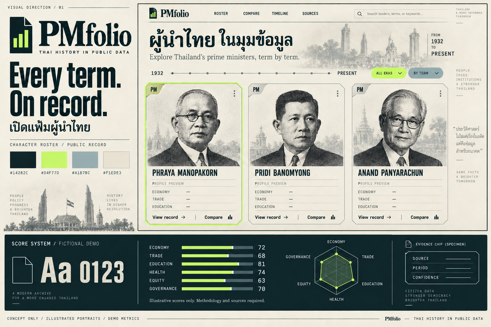

<div align="center">

<sub>THAILAND · THE PRIME MINISTER ARCHIVE</sub>

<h1>PMfolio</h1>

<p><strong>Every term. On record.</strong><br>ทุกวาระ มีหลักฐาน</p>

<p>เปิดแฟ้มนายกรัฐมนตรีไทย ผ่านประวัติ ตัวเลข และบริบทของแต่ละยุค</p>

<p>
  <a href="https://artmasster.github.io/pmfolip/"><strong>เปิดเว็บไซต์</strong></a>
  &nbsp; · &nbsp;
  <a href="https://artmasster.github.io/pmfolip/?view=vs"><strong>เข้าห้อง VS</strong></a>
  &nbsp; · &nbsp;
  <a href="docs/methodology.md">วิธีคิดดัชนี</a>
  &nbsp; · &nbsp;
  <a href="docs/development.md">คู่มือนักพัฒนา</a>
</p>

<p>
  
  
  
  
</p>

<a href="https://artmasster.github.io/pmfolip/">
  
</a>

<p><sub>ภาพแนวทางแบรนด์ ใช้ภาพประกอบและตัวเลขสาธิต ไม่ใช่ภาพหน้าจอหรือคะแนนจริงของบุคคล</sub></p>

</div>

---

## การใช้ AI และวัตถุประสงค์ของโครงการ

โครงการนี้พัฒนาระบบ จัดทำเนื้อหา และออกแบบวิธีประเมินข้อมูลโดยใช้ **AI รุ่น GPT-6 Astra** ณ วันที่ **3 ตุลาคม พ.ศ. 2569 (2026)** เพื่อเป็นสื่อและเอกสารประกอบการศึกษา ค้นคว้า และทำความเข้าใจประวัติศาสตร์การเมืองไทยผ่านข้อมูลสาธารณะ

AI ช่วยรวบรวม สังเคราะห์ และวิเคราะห์หลักฐาน รวมถึงพัฒนาการคำนวณดัชนีที่แสดงบนเว็บไซต์ ตัวเลขสถิติอ้างอิงจากแหล่งข้อมูลที่ระบุไว้ โดยบางชุดเป็นค่าประมาณของผู้ผลิตข้อมูลต้นทาง ส่วนคะแนนเป็นค่าคำนวณตามสูตรของโครงการ ไม่ได้เติมตัวเลขในปีที่ไม่มีข้อมูล การรวบรวม การตีความ และการประเมินด้วย AI อาจมีข้อผิดพลาดหรือข้อจำกัด จึงควรตรวจสอบกับหลักฐานต้นทางประกอบเสมอ

โครงการนำเสนอข้อมูลด้วยความเคารพต่อบุคคลที่กล่าวถึง **ไม่มีเจตนาดูหมิ่น ใส่ร้าย ลดทอนคุณค่า หรือก่อให้เกิดความเสียหายแก่บุคคลใด** รูปแบบการ์ด ค่าพลัง และ VS มีไว้ช่วยสำรวจข้อมูลเพื่อการเรียนรู้ ไม่ใช่คำตัดสินคุณค่า ความดี ความผิด หรือความสามารถโดยรวมของบุคคล หากพบข้อคลาดเคลื่อน สามารถแจ้งแก้ไขพร้อมหลักฐานผ่าน [issue](https://github.com/artmasster/pmfolip/issues)

## ประวัติศาสตร์ที่เปิดดูได้ทีละคน

**PMfolio = Prime Minister + Portfolio** นำรูปแบบการเลือกตัวละครมาใช้กับแฟ้มนายกรัฐมนตรีไทย ตั้งแต่คนแรก ค้นหาคนที่สนใจ เปิดดูบันทึกสำคัญ แล้วเลือกสองคนมาอ่านข้อมูลคู่กันในห้อง **VS**

| แฟ้มบุคคล | มิติการประเมิน | ตัวชี้วัด |
|:---:|:---:|:---:|
| **32 คน** | **9 ด้าน** | **26 ชุด** |

<sub>Snapshot วันที่ 3 ตุลาคม 2026 · จำนวนข้อมูลและปีที่ครอบคลุมแตกต่างกันตามบุคคลและตัวชี้วัด</sub>

## เลือกคน เปิดแฟ้ม เข้า VS

| ส่วนของเว็บ | เปิดดูอะไรได้บ้าง |
|:---|:---|
| **Roster** | การ์ดนายกฯ ค้นหาชื่อ กรองยุค และสลับเป็นเส้นเวลา |
| **Public record** | ช่วงดำรงตำแหน่ง บันทึกสำคัญ ตัวเลขรายปี และลิงก์หลักฐาน |
| **VS room** | เลือกสองคนและช่วงวาระ ดู radar เทียบรายด้าน สลับเป็นตัวเลขจริง สุ่มคู่ และแชร์ลิงก์ |
| **Evidence library** | ดาวน์โหลดชุดข้อมูล ตรวจหน่วย ช่วงปี นิยาม และวิธีคำนวณ |

ครอบคลุม **เศรษฐกิจ · การคลัง · การค้า · การศึกษา · สุขภาพ · ความเหลื่อมล้ำ · โครงสร้างพื้นฐาน · สิ่งแวดล้อม · ธรรมาภิบาลและสิทธิ**

## ค่าพลังที่อ่านย้อนกลับไปถึงหลักฐานได้

ดัชนี **0–100** แสดงตำแหน่งของค่าที่ใช้ในประวัติข้อมูลไทยของตัวชี้วัดนั้น เปิดดูค่าดิบ หน่วย ปี และต้นทางประกอบได้ ส่วน VS เลือกตัวชี้วัดชุดเดียวกันให้ทั้งสองฝั่ง และไม่นับชุดข้อมูลสำรองซ้ำ

- **หลายปีในวาระ** มีค่ารายปีที่เข้าเกณฑ์อย่างน้อยสองค่า
- **ข้อมูลปีเดียว** แสดงค่าที่มีจริง พร้อมระบุว่ายังสรุปแนวโน้มไม่ได้
- **บริบทประเทศ** ข้อมูลทั้งปีที่คาบเกี่ยววาระสั้น ไม่ใช่ผลลัพธ์เฉพาะบุคคลในช่วงนั้น

> **ข้อมูลขาดไม่เท่ากับศูนย์** และผลลัพธ์ระดับประเทศไม่ได้พิสูจน์ฝีมือส่วนบุคคล การคลังแสดงตัวเลขเป็นบริบทโดยไม่ให้คะแนน ไม่มีคะแนนรวมประกาศผู้ชนะ

[อ่านสูตร เกณฑ์ปี และข้อจำกัดทั้งหมด →](docs/methodology.md)

## เริ่มพัฒนา

ใช้ **Node.js 22 LTS** และ npm ตัวเว็บเป็น static app ใช้ข้อมูล snapshot ใน repository ไม่ต้องตั้งค่า API key หรือฐานข้อมูล

```bash
git clone https://github.com/artmasster/pmfolip.git
cd pmfolip
npm ci
npm run dev
```

เปิด URL ที่แสดงใน terminal

<details>
<summary><strong>ตรวจโค้ด ทดสอบ และสร้าง production build</strong></summary>

```bash
npm run check
npm test
npm run build
npm run preview
```

ไฟล์สำหรับเผยแพร่อยู่ใน `dist/` ดูรายละเอียดการรันและอัปเดตหลักฐานใน [คู่มือนักพัฒนา](docs/development.md)

</details>

<details>
<summary><strong>โครงสร้างโปรเจกต์</strong></summary>

```text
src/
  components/ui/   UI controls ที่ใช้ร่วมกัน
  data/            รายชื่อ ตัวเลข และแหล่งอ้างอิง
  lib/             การจับปี คำนวณดัชนี และเปรียบเทียบ
  App.tsx          Roster, profiles และห้อง VS
public/portraits/  ภาพบุคคลจากต้นทางที่มีเครดิต
scripts/          เครื่องมือดึงข้อมูลและภาพประกอบ
docs/             วิธีวิจัย ที่มา และแนวทางออกแบบ
```

</details>

## ที่มาของข้อมูล

ใช้ชุดข้อมูลจาก **World Bank WDI / WGI, Maddison Project, V-Dem, UNDP, UNESCO UIS** และงานประวัติศาสตร์ที่เผยแพร่ผ่าน **Our World in Data** แต่ละชุดเก็บชื่อแหล่ง หน่วย และปีที่มีค่าจริงไว้ด้วย

| เอกสาร | รายละเอียด |
|:---|:---|
| [วิธีวิจัยและการคำนวณ](docs/methodology.md) | สูตรดัชนี การเลือกปี การเทียบข้ามยุค และข้อจำกัด |
| [ประวัติบุคคลและเครดิตภาพ](docs/leader-sources.md) | หลักฐานรายชื่อ วาระ เหตุการณ์ และสิทธิ์ใช้ภาพ |
| [เศรษฐกิจย้อนหลัง](docs/historical-data.md) | Maddison Project, GDP ต่อคน และวิธีทำซ้ำ |
| [สังคมและการศึกษา](docs/extended-data.md) | V-Dem อายุขัย และชุดข้อมูลการศึกษาเพิ่มเติม |
| [แนวทางแบรนด์](docs/design.md) | โทนกระดาษ หมึกเข้ม lime และรูปแบบแฟ้มสาธารณะ |

พบข้อมูลที่ควรแก้ไข สามารถ [เปิด issue](https://github.com/artmasster/pmfolip/issues) พร้อมแหล่งอ้างอิง ปี และนิยามที่เกี่ยวข้อง เพื่อให้ตรวจสอบและปรับปรุงได้

ภาพและชุดข้อมูลคงสัญญาอนุญาตของต้นทางแต่ละรายการ ดูเครดิตและเงื่อนไขในเอกสารและ metadata ของชุดข้อมูล

---

<p align="center"><strong>PMfolio</strong><br><sub>Every term. On record.</sub></p>
